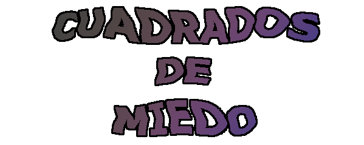
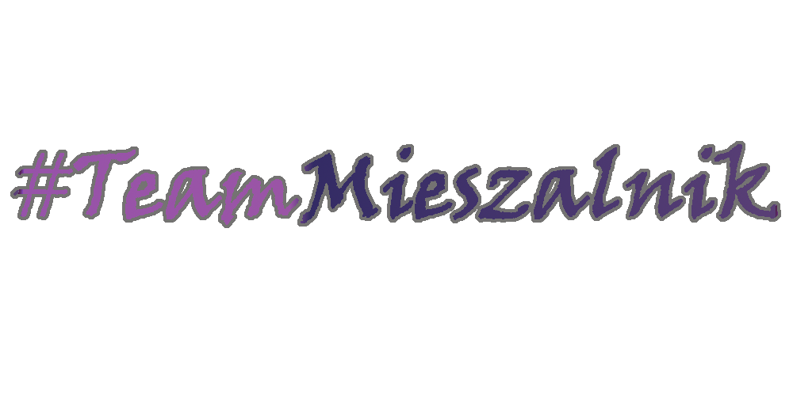

## [Play for yourself!](https://team-mieszalnik.github.io/CuadradosDeMiedo/)  

## Description
This game was developed as a Computer Graphics project at Silesial University of Technology.
Created using Unity 2019.3.5f1.

We hope you like it and manage to rid this world of those damn squares

 

## Our team:
[Michał Lampel](https://github.com/Swagsen)
[Dominik Bistyga](https://github.com/dominikbis)
[Paweł Zawierucha](https://github.com/PawZawDev)
[Michał Szopa](https://github.com/SchopenXD)

###### Team Mieszalnik 2020
